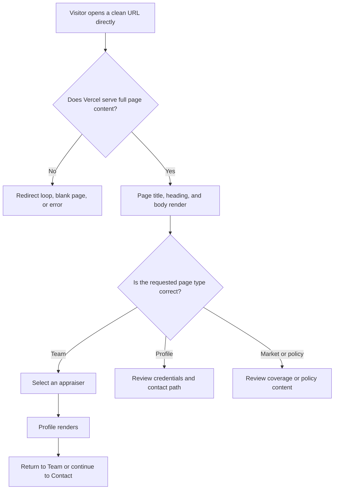
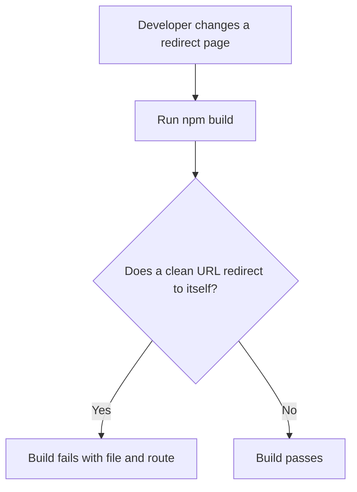

# Dogfood Report - codex/fix-clean-url-loops

> Diff-scoped browser QA of `codex/fix-clean-url-loops` vs `main`. Generated by `/ce-dogfood-beta` on 2026-07-13.

## Diff Summary

- Restores the full content at 20 root HTML files so Vercel clean URLs render pages instead of self-redirecting.
- Keeps the root pages synchronized with their latest directory-page equivalents, including the current GTM migration from `main`.
- Adds a build-time route guard that rejects JavaScript redirects and meta refreshes that send a clean URL back to itself.

## Personas

No strategy, vision, or persona file exists in the repository, so these personas are inferred from the site and the reported failure.

- **Prospective appraisal client** - needs to confirm expertise, service area, and find the right contact without navigation friction.
- **Referral partner or industry peer** - needs to locate a named appraiser and their credentials or contact path quickly.
- **Compliance or accessibility visitor** - needs reliable direct access to privacy, terms, and accessibility information.

## Flows Tested

## Test Matrix & Results

| # | Flow | Journey / Scenario | Status | Issue | Fix | Commit |
|---|------|--------------------|--------|-------|-----|--------|
| 1 | Direct entry | Load all 20 repaired clean URLs and confirm full HTML, HTTP 200, and no self-redirect | Pass | - | - | - |
| 2 | Team journey | Open `/team`, inspect the roster, open a profile, and return to the team/contact path on desktop | Pass | - | - | - |
| 3 | Team journey | Open `/team` at mobile width and confirm content, navigation, and stable URL | Fixed | AOS entrance positions created 69 px of horizontal overflow at 390 px width | Clip horizontal overflow on the team document root and body; add a build guard | `502b819` |
| 4 | Profile entry | Load every repaired appraiser profile directly and confirm meaningful content and navigation | Pass | - | - | - |
| 5 | Market and policy entry | Load `/market-areas`, `/privacy-policy`, `/terms-of-service`, and `/accessibility` and inspect destination links | Pass | - | - | - |
| 6 | Adjacent regression | Load the homepage and confirm primary navigation still reaches Team | Pass | - | - | - |
| 7 | Build guard | Run `npm run build` and confirm the clean-URL regression check passes | Pass | - | - | - |

## What Was Fixed

### Clean URLs redirected to themselves - `26dc56f`

- **Symptom:** Visitors saw blank pages that repeatedly navigated without rendering the requested content.
- **Root cause:** Vercel resolves a clean route such as `/team` to `team.html`, while that file redirected the browser back to `/team`. The full page at `team/index.html` was therefore unreachable.
- **Fix:** The 20 affected root HTML files now contain the full current page content that Vercel serves.
- **Regression test:** `scripts/check-clean-url-loops.mjs` fails when a JavaScript redirect or meta refresh targets its own clean route.

### Latest tracking changes preserved - `732a961`

- **Symptom:** A clean merge could have restored pre-migration tracking markup even though Git reported no conflict.
- **Root cause:** Every directory-page source changed on `main` after the repair branch was created.
- **Fix:** The branch merged current `main`, then resynchronized all restored root pages with their latest directory equivalents.
- **Regression test:** Content parity was checked for every root/directory page pair before deployment.

### Mobile horizontal overflow - `502b819`

- **Symptom:** At a 390 px viewport, off-screen AOS entrance positions allowed the team page to scroll 69 px horizontally.
- **Root cause:** The document root did not clip horizontal overflow while AOS temporarily transformed elements beyond the viewport.
- **Fix:** `team.html` and `team/index.html` now clip horizontal overflow on both the `html` and `body` elements.
- **Regression test:** The route build check requires both team page sources to retain the overflow guards, and browser QA confirms `scrollX` remains zero at mobile width.

## Console Errors

No page errors were reported by `agent-browser`. The existing Tailwind CDN production-use warning remains informational and is unrelated to this change.

## Paper Cuts

- **Prospective appraisal client, medium severity:** The restored team page allowed horizontal movement on mobile during AOS animations. Fixed in `502b819`.
- No remaining paper cuts were found within the changed journeys.

## Human Verifications

- Production deployment: approved by Kyle; pending merge and live smoke test.
- Client notification email: approved by Kyle; pending successful production verification.

## Decisions for a Human

None.

## Learnings

- With Vercel clean URLs enabled, a sibling `route.html` takes precedence for `/route`; a redirect stub in that file must never target `/route` itself.
- Git mergeability does not detect semantic drift between duplicate page sources. Root/directory parity must be checked when both layouts exist.

## Final Status

Ready to ship. Every dogfood scenario passes, the one mobile paper cut found was fixed and regression-guarded, all automated PR checks are green, and the branch is current with `main`. Production smoke testing and the approved client notification remain as post-merge steps.
